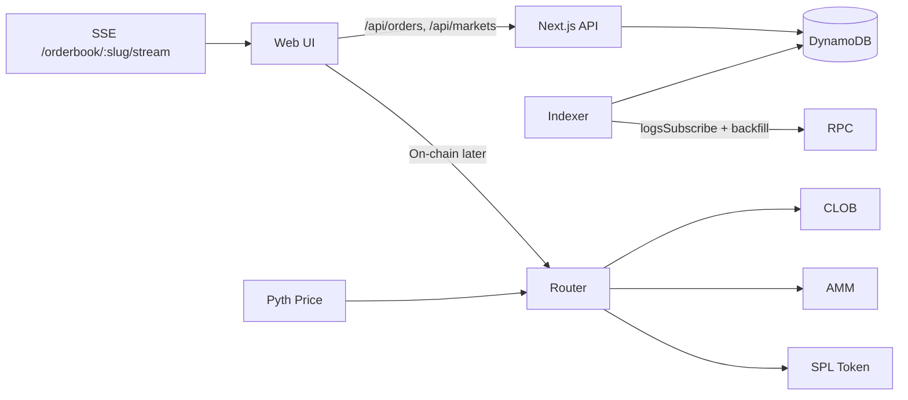

# Integration Roadmap (Phases 1–5)

This roadmap summarizes deliverables and hand-offs across contracts, indexer, DynamoDB, and web.

## Phase 1 — Math (Complete)
- `development-specs/MATHEMATICAL_FRAMEWORK.md` updated with discretization & on-chain approximations

## Phase 2 — Programs & Indexer
- `development-specs/ANCHOR_PROGRAMS_SCOPING.md` — accounts, instructions, events, diagrams
- `development-specs/INDEXER_SKELETON.md` — logsSubscribe + backfill, idempotency, upsert mapping
- `packages/solana_prediction/Anchor.toml` — keep existing; add programs once IDs decided

Checklist:
- Create four program crates: `market_factory`, `clob`, `amm`, `router`
- Emit events with fields: `tx_sig`, `slot`, `owner`, ids, amounts
- Indexer: decode via IDL discriminators; upsert to DynamoDB with idempotency keys

## Phase 2 — DynamoDB Schema (GSIs)
- `development-specs/DYNAMODB_GSIS.md` — GSIs for markets, orders, trades, positions
- After GSI creation, switch web queries from `ScanCommand` to `QueryCommand`

## Phase 3 — Web Enhancements
- `development-specs/WEB_ENHANCEMENTS_PLAN.md` — creator validation, collateral preview, claims flow
- Toggle feature flag `NEXT_PUBLIC_ONCHAIN=false` until programs go live

## Phase 4 — Oracle Resolution
- `development-specs/ORACLE_RESOLUTION_FLOW.md` — Pyth checks (status, staleness, confidence, exponent)
- Instruction: `resolve_market(price_account, params)` emits `MarketResolved`

## Phase 5 — Testing & Performance
- `development-specs/TESTING_AND_PERF.md` — unit/integration/e2e, fixtures, perf targets

## Runtime Environment (AWS DynamoDB)
- Template at `apps/web/env.example` — set `AWS_REGION` and credentials via IAM or environment
- Tables: `markets`, `orders`, `trades`, `positions`, `control`

## System Diagram

