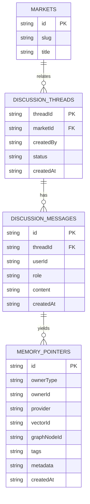

# Memory-Enabled Agents: Minimal Integration Roadmap (V1)

This roadmap focuses on non-destructive, additive changes to introduce Mem0-based memory for participants and creators. It follows AG-UI principles and wires through ai/indexer/database/api/web gradually.

- **Source foundations**: mem0 OSS features (graphMemory, rerankers, multimodal, AWS Bedrock) and AG-UI protocol insights.
- **MVP scope**: Comments/discussions ingestion + market context snapshots + search with optional rerank/graph.

## Milestones

- [ ] M1: Packages scaffolding
  - [ ] ai: `MemoryService` wrapper around `mem0ai` (add, search, config)
  - [ ] indexer: context exporters (DeFiLlama + Solana snapshots) for memory
  - [ ] database: DynamoDB tables for `discussion_threads`, `discussion_messages`, `memory_pointers`
- [ ] M2: API endpoints (apps/api)
  - [ ] POST /api/memory/index (comment/discussion/context)
  - [ ] GET /api/memory/search (query, filters, rerank, graph)
- [ ] M3: Web wiring (apps/web)
  - [ ] Experimental page to view/search discussions and related memories
  - [ ] Hook shadcn components; prepare AG-UI client integration plan
- [ ] M4: Infra draft (cloudformation)
  - [ ] Draft ECS/ECR or EC2 Compose for `mem0` service; parameters only, keep off by default
  - [ ] Outputs + env plumb for vector DB and graph store

## Design Decisions (V1)

- **Memory provider**: `mem0ai` Node SDK. Config toggles for graph store and reranker.
- **Vector DB / Graph store**: external (user-provided). Draft supports Neo4j (graph) and either local ST or Cohere reranker.
- **Embeddings**: via mem0 (optionally AWS Bedrock Titan embeddings when available).
- **Persistence**: 
  - Primary memories live in mem0-managed backends.
  - Dynamo stores pointers and discussion message metadata for app governance and joins.

## Data Model (initial)

- discussion_threads(threadId, marketId, createdBy, createdAt, status)
- discussion_messages(id, threadId, userId, role, content, attachments?, createdAt)
- memory_pointers(id, ownerType, ownerId, provider, vectorId?, graphNodeId?, tags[], metadata, createdAt)

Mermaid ER (simplified):

## API Contract (draft)

- POST /api/memory/index
  - body: { type: "comment"|"discussion"|"context", payload, userId, marketId?, threadId?, options? }
  - returns: { ok: true, ids: string[] }
- GET /api/memory/search
  - query: q, userId?, agentId?, runId?, limit=5, rerank=bool, enableGraph=bool
  - returns: { results: [{ memory, score, metadata }] }

## AG-UI Integration Plan

- Adopt shared state for thread and selection
- Stream search and tool results to UI
- Interrupts for approve/deny memory writes from users

## CloudFormation Draft (not applied yet)

- Parameters (new): Mem0Enabled, Mem0Image, VectorDB, GraphStore, RerankerProvider
- ECS or EC2 option templates; off by default (non-destructive)

## Next Steps

- Validate types for AG-UI events and shared state with you
- Choose graph store (Neo4j Aura vs Neptune vs Kuzu) and reranker (ST vs Cohere)
- Turn on infra parameters and deploy mem0 stack
