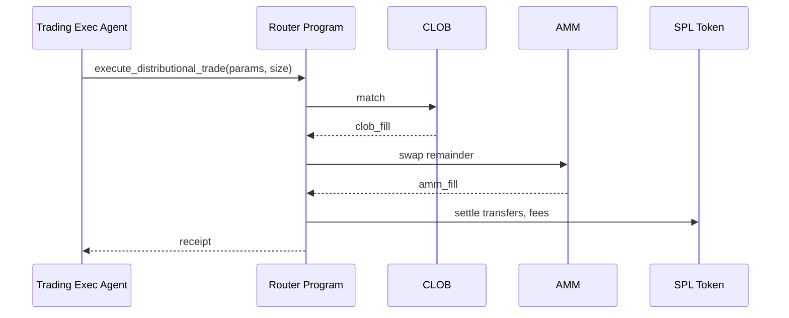

# AI Agentic Workflows for Prediction Market Investors


## models to be used:
- openai / perplexity sonar
- time series models : AWS chrnos for the time series prediction.


## Overview

This section defines context-engineering–grounded specifications for two agents in a Solana distributional prediction market: the creator agent and the investor agent. It applies Anthropic’s “Effective context engineering for AI agents” to achieve high-signal, minimal-token contexts, reliable tool use, and long-horizon coherence.

1. **Agent types and roles**
   - **Creator agent**: guides market prompt design, validates oracle and resolution setup, and manages market lifecycle handoffs (pre/post deadline).
   - **Investor agent**: recommends positions, manages orders and risk per user intent, and assists with claims post-resolution.

2. **Two-context windows**
   - **Global/shared window**: protocol state (program IDs, market lists, top-of-book, oracle accounts), platform policies, and current ETL summaries (DeFiLlama, Pyth). Curated for all users.
   - **Personal window**: user portfolio, preferences (risk, time horizon), recent conversations, and per-user strategy notes. Updated per turn and pruned to avoid context rot.

3. **Just-in-time retrieval (JITR)**
   - Fetch bulky data only when needed via retrieval pointers: embeddings from Weaviate (docs, research), structured rows from DynamoDB (notes, orders), and oracle snapshots from Pyth.
   - Use compact summaries and handles (IDs, URIs) instead of raw payloads in the active window; expand on demand.

4. **Tool design principles**
   - Minimal, non-overlapping, token-efficient tools (e.g., `defillama.fetch(protocol|chain)`, `pyth.get_price(account)`, `db.query_top_of_book(marketId)`), consistent schemas, and explicit params.
   - Concise outputs; include only fields the agent needs for the next decision. Favor errors with actionable remediation hints.

5. **Memory for long-horizon tasks**
   - **Compaction**: periodic summarization of message/tool traces to preserve salient state while minimizing tokens.
   - **Structured note-taking**: external NOTES persisted to DynamoDB (per-user and per-market) for reliable recall into context.
   - **Sub-agents**: specialized workers (e.g., data ingestion, modeling) explore deeply and return distilled, 1–2k-token briefs to the coordinator agent.

6. **Persistent memory architecture**
   - **Weaviate** for semantic vector search over market docs, modeling references, and research; stores embeddings + metadata.
   - **DynamoDB** for structured notes, action logs, checkpoints, and cached API results (with TTLs).
   - **Optional Amazon Neptune (KG)** for cross-entity relations (markets ↔ oracles ↔ protocols ↔ users) to support higher-order reasoning.

7. **ETL data sources**
   - **DeFiLlama** (chain TVL, volumes, stablecoins, protocol lists), **Pyth** (price accounts), and **Perplexity/Exa** (structured web intel) with scheduled refresh.
   - Store compacted summaries in DynamoDB; index source docs in Weaviate for JIT retrieval.

8. **Hosting and orchestration**
   - **LangGraph/LangChain** for agent flows, tool calling, and sub-agent coordination.
   - **LLMs**: OpenAI (hosted) and/or local **Ollama**; choose per task for latency/cost/privacy.

9. **Safety and guardrails**
   - Role- and scope-bounded tools, input/output sanitization, budget limits, and red-team prompts for unsafe actions.
   - Secrets isolation, rate limiting, and allowlists for external sources; logging for auditability.

10. **KPIs**
   - **Context efficiency** (tokens in vs. decision value), **retrieval accuracy/latency**, fill ratio and P&L attribution, and **indexer lag → UI** latency.
   - **Memory recall precision** (notes/embeddings), user satisfaction (creator/investor), and guardrail incident rate.

## Architecture

### Multi-Agent System Components

1. **Data Ingestion Agent**
2. **Market Analysis Agent**
3. **Trading Execution Agent**
4. **Risk Management Agent**
5. **Liquidity Provision Agent**
6. **Learning & Optimization Agent**

### Solana-Aligned Roles and Data Flows

- **Data Ingestion Agent**: Pulls on-chain stats and ecosystem context.
  - Sources: 
    - ETL pipeline from the scraping of the data from multiple sources 
        - Defillama (protocol list, TVL, per-protocol TVL), DeFiLlama API (chain TVL, DEX volume, stablecoins), Pyth/Chainlink for price.
        - perplexity, exa.ai for the structured web data sources.  
    - data is then stored in the dynamodb table: `withDynamoDBCache` in production / developer version using `DYNAMODB_CACHE_TABLE_NAME`.


- **Market Analysis Agent**: Computes divergences vs. reference distributions, references Metaculus-style modeling resources for priors.

- **Trading Execution Agent**: Calls on-chain `execute_distributional_trade` with positions sized by Kelly-like function (see `MATHEMATICAL_FRAMEWORK.md`).

- **Risk Management Agent**: Enforces position and collateral limits per market; issues margin calls.

- **Liquidity Provision Agent**: Rebalances AMM inventory near resolution or volatility spikes.

- **Learning Agent**: Trains on outcomes and forecasting resources (Metaculus Prediction Resources) to improve priors.

```mermaid
flowchart TD
  A[External Data\nDeFiLlama, Oracles] --> B[Data Ingestion Agent]
  B --> C[Market Analysis Agent]
  C --> D[Opportunity Detector]
  D -->|Signals| E[Trading Exec Agent]
  D -->|No-op| C
  E --> F[Router Program\n(CLOB+AMM)]
  F --> G[SPL Token\nsettlement]
  E --> H[Risk Mgmt Agent]
  H --> E
  C --> I[Learning Agent]
  I --> C
```

## 1. Automated Market Inefficiency Analysis

### Data Sources Integration

- **On-Chain Data**: Market consensus, volume, liquidity
- **External APIs**: News feeds, social sentiment, economic indicators
- **Oracle Data**: Real-time price feeds, event data

#### DeFiLlama (Solana) endpoints

- Chain TVL (historical): `https://pro-api.llama.fi/v2/historicalChainTvl/solana`
- DEX volumes: `https://pro-api.llama.fi/v2/volumes/dex/solana`
- Stablecoins on Solana: `https://stablecoins.llama.fi/stablecoins/chain/solana`
- Protocol list: `https://api.llama.fi/protocols` (filtered where `chains` includes `Solana`) — see `getSolanaProtocolsCached()`

```typescript
// apps/web/lib/server/defillama.ts
export async function getSolanaProtocolsCached() { /* uses withDynamoDBCache in prod */ }
```

### Anomaly Detection Algorithm

```python
def detect_inefficiency(market, external_data):
    consensus_dist = market.get_consensus_distribution()
    external_signal = analyze_external_data(external_data)
    
    divergence = calculate_kl_divergence(consensus_dist, external_signal)
    
    if divergence > THRESHOLD:
        return {
            'opportunity': True,
            'confidence': calculate_confidence(divergence),
            'suggested_action': generate_trade_signal(divergence)
        }
    return {'opportunity': False}
```

### On-chain Execution Flow (Mermaid)



## 2. Bayesian Trading Strategies

### Belief Updating

```python
def bayesian_update(prior, new_evidence):
    likelihood = calculate_likelihood(new_evidence)
    posterior = (likelihood * prior) / marginal_probability(new_evidence)
    return normalize(posterior)
```

### Optimal Position Sizing

```python
def kelly_criterion_distributional(belief, market_odds):
    edge = calculate_edge(belief, market_odds)
    optimal_fraction = edge / variance(belief)
    return min(optimal_fraction, MAX_POSITION_SIZE)
```

## 3. Portfolio Risk Management

### Multi-Market Correlation

```python
def calculate_portfolio_risk(positions):
    correlation_matrix = estimate_correlations(positions)
    var = calculate_value_at_risk(positions, correlation_matrix)
    cvar = calculate_conditional_var(positions, correlation_matrix)
    
    return {
        'var_95': var,
        'cvar_95': cvar,
        'diversification_ratio': calculate_diversification(correlation_matrix)
    }
```

## 4. Automated Market Making

### Quote Generation

```python
def generate_quotes(market_state, inventory):
    mid_price = market_state.consensus_mean
    spread = calculate_optimal_spread(market_state.volatility, inventory)
    
    bid = mid_price - spread/2
    ask = mid_price + spread/2
    
    return {'bid': bid, 'ask': ask, 'size': calculate_quote_size(inventory)}
```

## 5. Machine Learning Predictions

### Time-Series Forecasting

- **Model**: LSTM/Transformer for price movement prediction
- **Features**: Historical prices, volume, on-chain metrics
- **Output**: Probability distribution over future outcomes

### Resolution Outcome Prediction

- **Model**: Gradient Boosted Trees
- **Features**: Market metadata, external signals, historical resolutions
- **Output**: Predicted outcome value with confidence interval

## Integration Points

### Solana Program Interface

```rust
pub fn agent_execute_trade(
    ctx: Context<AgentTrade>,
    distribution_params: DistributionParams,
    position_size: u64,
) -> Result<()> {
    // Verify agent authority
    require!(ctx.accounts.agent.is_authorized, ErrorCode::Unauthorized);
    
    // Execute trade with agent's strategy
    execute_distributional_trade(ctx, distribution_params, position_size)
}
```

### WebSocket Real-Time Updates

```javascript
const ws = new WebSocket('wss://api.market.com/stream');

ws.on('market_update', (data) => {
    agent.processMarketUpdate(data);
    if (agent.shouldTrade()) {
        agent.executeTrade();
    }
});
```

## Decision-Making Workflow

```
[Data Collection] 
    ↓
[Belief Update (Bayesian)]
    ↓
[Opportunity Detection]
    ↓
[Risk Assessment]
    ↓
[Position Sizing (Kelly)]
    ↓
[Trade Execution]
    ↓
[Performance Monitoring]
    ↓
[Model Retraining]
```

## Security & Safety

- **Position Limits**: Maximum exposure per market
- **Kill Switch**: Emergency stop for all agents
- **Audit Trail**: All decisions logged
- **Simulation Mode**: Test strategies before live deployment
