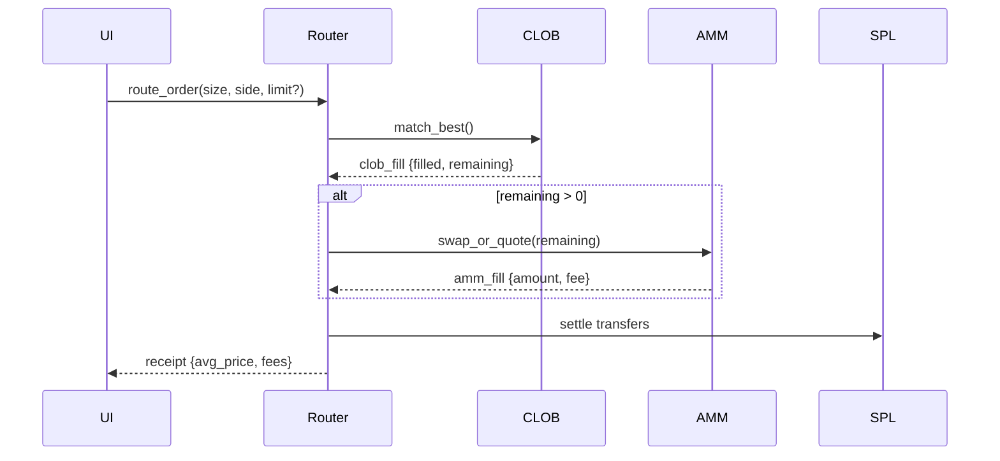
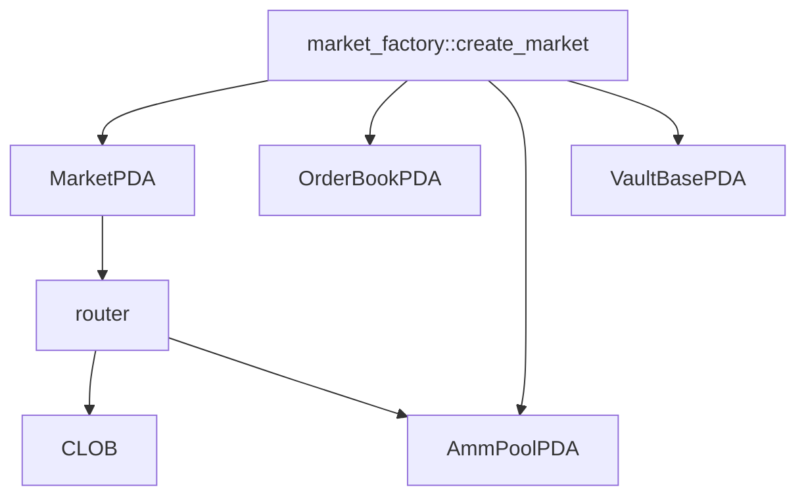

# Anchor Programs Scoping (market_factory, amm, clob, router)

This document scopes the four Anchor programs and their interfaces. It complements `development-specs/solana-onchain-protocol.md`.

## Programs

- `market_factory`: creates markets, PDAs, initial vaults and AMM pool
- `clob`: central limit order book with price levels and FIFO queues
- `amm`: distributional CFMM following `MATHEMATICAL_FRAMEWORK.md` (discretized)
- `router`: validates intent, routes to CLOB then AMM, settles token transfers

## Common PDAs

```
MarketPDA         = seeds["market", market_symbol]
OrderBookPDA      = seeds["orderbook", MarketPDA]
AmmPoolPDA        = seeds["amm", MarketPDA]
VaultBasePDA      = seeds["vault", MarketPDA, mint]
UserPositionPDA   = seeds["position", MarketPDA, user]
OpenOrdersPDA     = seeds["oo", MarketPDA, user]
FeeVaultPDA       = seeds["fees", MarketPDA, mint]
StatsPDA          = seeds["stats", MarketPDA]
```

## Accounts (abbrev)

- `Market` { authority, symbol[16], outcome_range(i64,i64), resolution_time(i64), status, oracle(Pubkey), bump }
- `OrderBook` { tick_size_i64, levels_bids, levels_asks, seq, bump }
- `AmmPool` { k, b, grid_params, sigma_min, fee_bps, bump }
- `Position` { owner, market, collateral_locked, pnl_accum, bump }

## market_factory

- `create_market(params: { symbol: [u8;16], range: (i64,i64), resolution_time: i64, oracle: Pubkey, fee_bps: u16 })`
  - Creates `MarketPDA`, `OrderBookPDA`, `AmmPoolPDA`, `VaultBasePDA`, `FeeVaultPDA`
  - Emits `MarketCreated { market, symbol, oracle, ts }`

- `close_market()` (admin)

## clob

- `place_order({ side: Buy|Sell, price_i64, size_u64, tif?: u32 })`
  - Writes order to price level queue; emits `OrderPlaced { market, owner, side, price, size, id, ts }`
- `cancel_order({ id })`
  - Emits `OrderCancelled { market, owner, id, remaining, ts }`
- `match_best()` (keeper)
  - Pops from top-of-book; emits `TradeExecuted { market, bid_id, ask_id, price, size, ts }`

## amm

- `swap_or_quote({ size_u64, side, params? })`
  - Adjusts discretized distribution under invariant; collects fees
  - Emits `AmmSwap { market, side, avg_price, size, fee, ts }`
- `rebalance({ target_sigma })` (keeper)

## router

- `route_order({ size, side, limit? })`
  - Calls into `clob::match_best` first; if remainder > 0, calls `amm::swap_or_quote`
  - Emits `Routed { market, side, filled_clob, filled_amm, avg_price, fee_total, ts }`
- `settle()`
  - Handles SPL transfers among payer, vaults, counterparties, and fees

## Events (minimal fields)

- `MarketCreated { market, symbol, oracle, ts }`
- `OrderPlaced { market, owner, side, price, size, id, ts }`
- `OrderCancelled { market, owner, id, remaining, ts }`
- `TradeExecuted { market, price, size, maker, taker, ts }`
- `AmmSwap { market, side, avg_price, size, fee, ts }`
- `MarketResolved { market, outcome_i64, ts }`
- `CollateralLocked { market, owner, amount, ts }`
- `CollateralReleased { market, owner, amount, ts }`

## Diagrams




