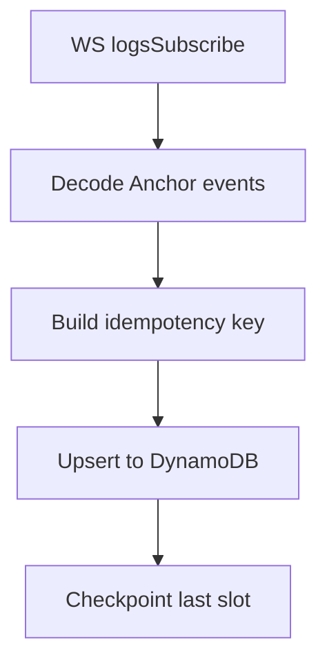

# Indexer Skeleton (Solana → DynamoDB)

## Overview
- Real-time: `logsSubscribe` WebSocket for program IDs: market_factory, clob, amm, router.


- fetching the current status of the protocol TVL, metrics and the external operations , with or without the use of the oracle. 

- Backfill: `getSignaturesForAddress`, `getTransaction` to decode historical events.

- Decode Anchor events using IDL discriminators; map to DynamoDB upserts with idempotency keys.


## Environment
```
RPC_URL=...
AWS_REGION=us-east-1
AWS_ACCESS_KEY_ID=...
AWS_SECRET_ACCESS_KEY=...
DYNAMODB_TABLE_MARKETS=markets
DYNAMODB_TABLE_ORDERS=orders
DYNAMODB_TABLE_TRADES=trades
DYNAMODB_TABLE_POSITIONS=positions
DYNAMODB_TABLE_CONTROL=control
```

## Idempotency
- Key: `idemp = txSig + ":" + ixIndex + ":" + eventDiscriminator`
- Conditional write: `attribute_not_exists(idempotency)` to prevent duplicates

## Upsert Mapping
- `OrderPlaced` → orders row, `status=Open`
- `OrderCancelled` → update orders `status=Cancelled`
- `TradeExecuted` → insert trade + adjust two orders `remaining` and possibly `status=Filled`
- `AmmSwap` → trade-like insert under `trades`
- `CollateralLocked/Released` → reflect in `positions`
- `MarketCreated` → add to `markets`

## Process Flow


## Pseudocode
```ts
const ws = new WebSocket(RPC_URL_WS);
subscribe(programIds);
ws.on('message', async (log) => {
  const { txSig, slot, ixIndex, event } = decodeAnchorEvent(log, idlMap);
  const idemp = `${txSig}:${ixIndex}:${event.discriminator}`;
  await putWithCondition(table, {...mapEvent(event), txSig, slot, idemp}, 'attribute_not_exists(idemp)');
  await updateCheckpoint(slot, txSig);
});

async function backfill(programId, start, end) {
  const sigs = await getSignaturesForAddress(programId, start, end);
  for (const s of sigs) {
    const tx = await getTransaction(s.signature);
    for (const log of tx.meta.logMessages) { /* decode and upsert same as live */ }
  }
}
```

## References
- Anchor events: https://www.anchor-lang.com/docs/features/events
- Logs and indexing patterns: see Carbon/Substreams articles
