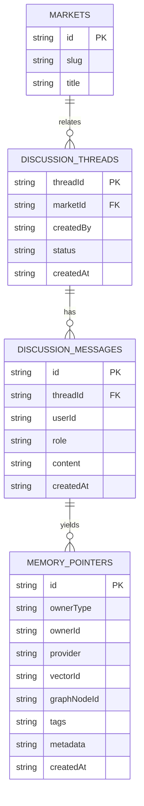
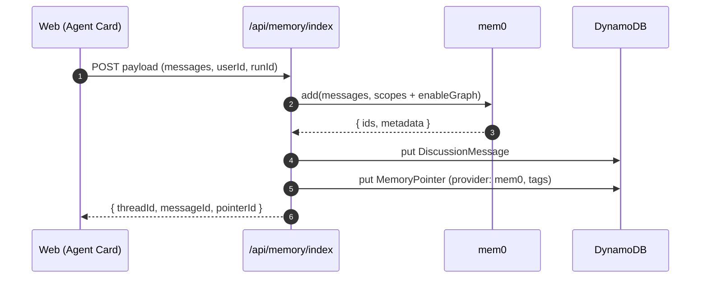
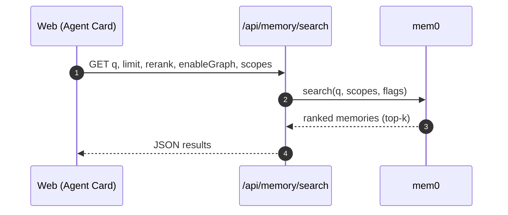
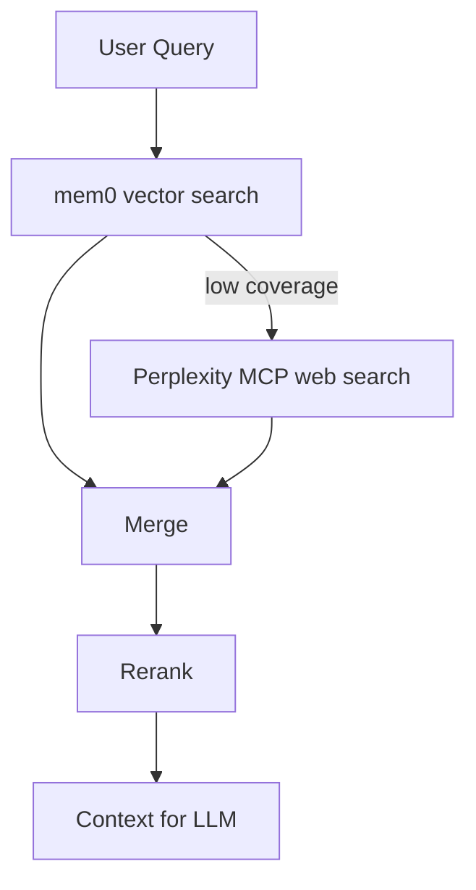

# Memory DB Schema V1 (Minimal, Non-destructive)

Compact initial schema for participants, creators, discussions, and memory pointers. Vectors are not stored in DynamoDB; mem0 manages embeddings and optional graph storage. DynamoDB stores message metadata and provider pointers only.

## Tables (DynamoDB)

- discussion-threads
- discussion-messages
- memory-pointers
- creator-profiles (existing)
- comments (existing)
- markets, orders, trades, positions (existing)

## Entities

- DiscussionThread
  - threadId (PK)
  - marketId
  - createdBy
  - status: open|closed
  - createdAt, updatedAt?

- DiscussionMessage
  - id (PK)
  - threadId (FK -> DiscussionThread.threadId)
  - userId
  - role: user|assistant|system
  - content
  - attachments? [{type,url?,dataUrl?}]
  - createdAt

- MemoryPointer
  - id (PK)
  - ownerType: thread|message|market|user
  - ownerId
  - provider: mem0
  - vectorId? (if provider returns id)
  - graphNodeId? (if graph is enabled)
  - tags? [string]
  - metadata? {}
  - createdAt

## Relationships (Mermaid ER)

## Mem0 Integration (V1)

- Index: POST /api/memory/index
  - Normalizes payload to messages array and stores DiscussionMessage + MemoryPointer
- Search: GET /api/memory/search
  - Searches mem0 with optional reranker and graph flags

## Embeddings and RAG (Concise)

- Embeddings are generated by mem0 (hosted or self-hosted). We do NOT store vectors in DynamoDB.
- We pass user/agent/run scopes for multi-tenant isolation and better retrieval.
- Retrieval supports vector search, optional graph traversal, and reranking.

### Indexing Pipeline (V1)

### Query Pipeline (RAG)

### Retrieval Details

- Vector search: dense retrieval using mem0’s configured embedder.
- Graph memory (optional): enableGraph=true can traverse related nodes/edges before ranking.
- Reranking: reranker=true uses provider (sentence-transformers or Cohere) after initial recall.
- Filters: pass structured filters (e.g., tag:"market:<id>").

### Hybrid RAG with Perplexity MCP (Optional)

- For queries needing outside knowledge, chain mem0 retrieval with MCP Perplexity web search.
- Minimal flow:
  1) mem0.search() → top-k internal memories
  2) if low score or missing coverage → call Perplexity MCP with the same query
  3) merge contexts, deduplicate, final rerank → answer

## Next Iterations

- Add GSIs for threads_by_market and messages_by_thread
- Add user/agent run scoping to searches
- Add moderation and approvals for memory writes
