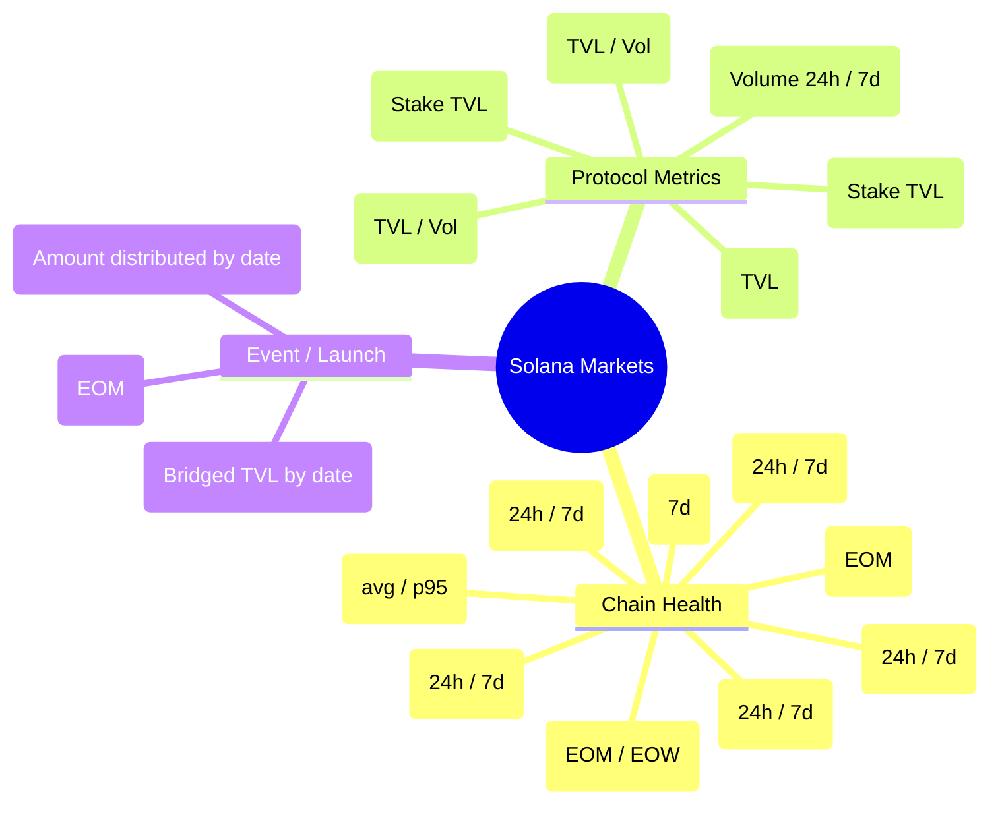

# Distribution Markets on Solana — Categories, Templates, and Resolution Rules

This document defines initial prediction market categories and standardized question templates for distribution markets on Solana, inspired by Paradigm’s “Distribution Markets” (continuous outcomes) and adapted to metrics and protocols available on DeFiLlama.

- Source context: Paradigm article on continuous probability trading (distribution AMM + range orders)
- Data context: DeFiLlama Solana metrics (TVL, DEX volume, fees, revenue, active addresses, transactions, stablecoins, perps volume, etc.)
- UI context: Polymarket-style tabs and trading widget, adapted for distributions (Gaussian input and range orders)

## Market Taxonomy

## Question Templates (Continuous Outcome)

Each template defines: question, resolution time, range, binning, prior, and source link.

- TVL (EOM)
  - Question: “What will Solana chain TVL be at end of {YYYY-MM}?”
  - Range: [$5B, $60B]; Bin: $250M; Resolution: 23:59:59 UTC of EOM
  - Prior: Gaussian centered at 30-day MA; σ = max(10% of MA, $1.5B)
  - Source: DeFiLlama chain TVL endpoint

- DEX Volume (24h)
  - Question: “What will Solana DEX 24h volume be on {YYYY-MM-DD}?”
  - Range: [$200M, $10B]; Bin: $50M; Resolution: 00:00–23:59:59 UTC snapshot
  - Prior: Gaussian at last 7-day mean; σ = 1.25× last 7-day std
  - Source: DeFiLlama DEX volume (chain=Solana)

- Chain Fees (24h)
  - Question: “What will Solana chain fees (USD) be on {YYYY-MM-DD}?”
  - Range: [$100k, $10M]; Bin: $50k; Resolution: day close UTC
  - Prior: Log-normal with μ,σ from last 30d; fallback Gaussian
  - Source: DeFiLlama chain fees

- Active Addresses (24h)
  - Question: “How many active addresses will Solana have on {YYYY-MM-DD}?”
  - Range: [200k, 10M]; Bin: 25k; Resolution: day close UTC
  - Prior: Gaussian at 30d MA; σ = 1.0× std
  - Source: DeFiLlama active addresses

- Transactions (24h)
  - Question: “How many transactions will Solana process on {YYYY-MM-DD}?”
  - Range: [10M, 200M]; Bin: 1M; Resolution: day close UTC
  - Prior: Gaussian at 30d MA; σ = 1.0× std
  - Source: DeFiLlama transactions

- Stablecoins Mcap (EOM)
  - Question: “What will Solana stablecoins market cap be at end of {YYYY-MM}?”
  - Range: [$5B, $40B]; Bin: $100M; Resolution: EOM UTC
  - Prior: Gaussian at 30d MA; σ = 8% of MA
  - Source: DeFiLlama stablecoins on Solana

- Protocol Volume/TVL (24h/EOM) — per protocol
  - Question: “What will {PROTOCOL} {TVL|24h volume} be on {DATE}?”
  - Range/Bin: based on current percentile; see table below
  - Prior: Gaussian around recent median; σ from recent MAD
  - Source: DeFiLlama protocol endpoints

## Binning and Range Selection

- Choose ranges to cover 99% of historical daily values.
- Use 100–250 bins for responsiveness (client chart + on-chain cost balance).
- For AMM math, store bin edges and weights; order book places liquidity across bin ranges.

## Distribution Trading Semantics

- Users input either:
  - Gaussian belief: mean and σ
  - Range order: [min, max] with stake S
- AMM / order book converts to bin weights; price per bin reflects implied probability density.
- Payout: proportional to final bin containing resolved value (or interpolated if exact value between bins).

## Resolution Rules (per template)

- Primary source = DeFiLlama chain/protocol metric for Solana.
- If source missing or outlier flagged:
  - Use secondary sources (official dashboards, explorer APIs) recorded on-chain/off-chain with hash.
- Dispute window (e.g., 24–72h) before finalization.

## Example Parameter Table (starter)

| Template | Range | Bin | Prior | Resolution |
|---|---|---|---|---|
| TVL (EOM) | $5B–$60B | $250M | N(30d MA, 10% MA) | EOM 23:59:59 UTC |
| DEX Vol (24h) | $0.2B–$10B | $50M | N(7d mean, 1.25×std) | Day close |
| Fees (24h) | $0.1M–$10M | $50k | Log-normal 30d | Day close |
| Active Addrs (24h) | 0.2M–10M | 25k | N(30d MA, std) | Day close |
| Txns (24h) | 10M–200M | 1M | N(30d MA, std) | Day close |
| Stablecoins (EOM) | $5B–$40B | $100M | N(30d MA, 8% MA) | EOM |

## Protocol-Specific Starters

- Jupiter: 24h volume — Range [$500M, $10B], Bin $50M
- Raydium: TVL — Range [$100M, $2B], Bin $10M
- Orca: TVL — Range [$100M, $2B], Bin $10M
- Jito: Stake TVL — Range [$3B, $20B], Bin $250M
- Kamino: TVL — Range [$300M, $5B], Bin $25M
- Marinade: Stake TVL — Range [$2B, $20B], Bin $250M

## Launch Checklist

- Define 5–10 initial markets across chain and 2–3 protocols.
- Seed via `/api/markets/seed` with question, range, prior snapshot.
- Display Distribution tab (consensus+user overlays) + Order Book tab (range orders) + Resolution tab.
- Comments/Embeds provide newsflow and data source discussions.
