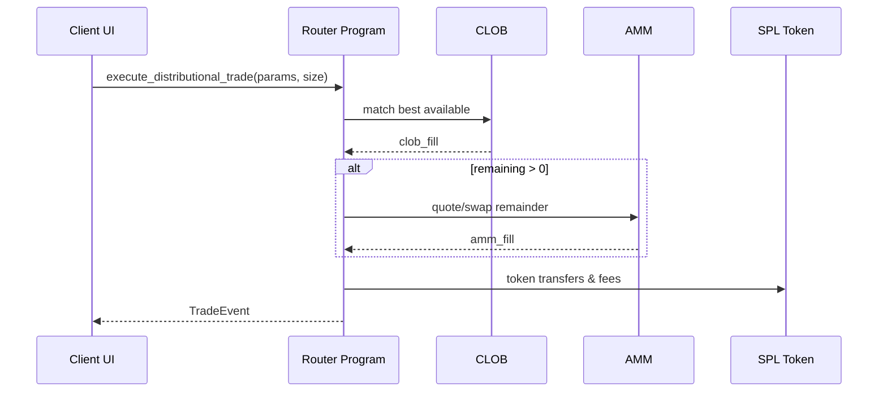

# Solana Distributional Prediction Markets - Complete Technical Specification

## Table of Contents
1. [Motivation & Vision](#motivation)
2. [Market Types](#market-types)
3. [User Stories - Market Creator](#market-creator-user-stories)
4. [User Stories - Market Participant](#market-participant-user-stories)
5. [Mathematical Framework](#mathematical-framework)
6. [AI Agentic Workflows](#ai-agentic-workflows)
7. [Hybrid Order Book Mechanics](#order-book-mechanics)
8. [Smart Contract Architecture](#smart-contract-architecture)

---

## Motivation

Current prediction markets (Polymarket, Kalshi) rely on binary or discrete outcomes with centralized oracles and limited flexibility. This contradicts the ethos of decentralized prediction markets which should be:
- **Trustless**: No reliance on centralized arbitration
- **Permissionless**: Anyone can create markets with custom logic
- **Continuous**: Support for distributional outcomes beyond binary yes/no

### Vision

Build a "more ethical version of pump.fun" based on Paradigm's [Distribution Markets](https://paradigm.xyz/2024/12/distribution-markets) thesis, enabling:

**Market Curators** can define probability distributions as continuous functions representing likelihood across all possible outcomes (e.g., "BTC price at year-end" rather than "BTC > $100k").

**Market Participants** can express nuanced beliefs by trading on probability density functions, earning returns proportional to forecast accuracy. 

---

## Market Types

### 1. **Distributional Markets** (Primary Focus)
- **Token Price Markets**: Continuous price prediction (e.g., "BTC price on Dec 31, 2025")
- **Scalar Events**: Numeric outcomes (e.g., "Total EV sales in 2027")
- **Temporal Events**: Time-based predictions (e.g., "When will GPT-5 launch?")

### 2. **Binary Markets** (Secondary)
- Yes/No outcomes with probability weights

### 3. **Categorical Markets**
- Multiple discrete outcomes with probability allocations

**MVP Reference**: UI/UX patterns inspired by [Metaculus](https://www.metaculus.com/) multi-modal prediction interface.
---

## Market Creator User Stories

### Complete End-to-End Workflow

#### Phase 1: Market Creation Initiation
**Entry Point**: User clicks "Create Market" from dashboard navigation

**UI Component**: Landing page with market type selector
- **Component**: Segmented control (3 options)
  - Binary Market
  - Categorical Market  
  - **Distributional Market** (highlighted as recommended)
- **State**: Unselected → Selected
- **Validation**: Must select one type before "Continue" button activates
- **Action**: Click "Continue" → Navigate to market configuration

---

---

## Detailed Specifications (Separate Documents)

The complete technical specifications have been broken down into focused documents:

### 1. **Market Creator Workflows** 
📄 [`MARKET_CREATOR_DETAILED_SPEC.md`](./MARKET_CREATOR_DETAILED_SPEC.md)

**Contents:**
- Complete UI flow from market creation to resolution
- All form fields, validation rules, and state transitions
- Distribution chart builder specifications
- Oracle configuration options
- Economic parameter setup
- Transaction flow and error handling
- Post-creation dashboard features

**Key Highlights:**
- 10-phase end-to-end workflow
- Detailed UI component state matrix
- Wallet integration specifications
- Resolution and dispute mechanisms

---

### 2. **Market Participant Workflows**
📄 [`MARKET_PARTICIPANT_DETAILED_SPEC.md`](./MARKET_PARTICIPANT_DETAILED_SPEC.md)

**Contents:**
- Market discovery and browsing interface
- Interactive distribution chart trading
- Position sizing and collateral calculations
- Order types (market, limit, stop-loss)
- Portfolio management dashboard
- AI-assisted trading features
- Claiming rewards workflow

**Key Highlights:**
- 6-phase trading journey
- Multiple prediction input methods (templates, parameters, free-form)
- Real-time P&L tracking
- Social and leaderboard features

---

### 3. **Mathematical Framework**
📄 [`MATHEMATICAL_FRAMEWORK.md`](./MATHEMATICAL_FRAMEWORK.md)

**Contents:**
- L² norm-based CFMM for continuous distributions
- Gaussian distribution pricing formulas
- Collateralization requirements and calculations
- Trader profit/loss functions
- Liquidity provider economics
- Market scoring rules

**Key Formulas:**
```

### PDAs & Accounts

```
MarketPDA         = seeds["market", market_symbol]
OrderBookPDA      = seeds["orderbook", MarketPDA]
AmmPoolPDA        = seeds["amm", MarketPDA]
VaultBasePDA      = seeds["vault", MarketPDA, mint]
FeeVaultPDA       = seeds["fees", MarketPDA, mint]
UserPositionPDA   = seeds["position", MarketPDA, user]
OpenOrdersPDA     = seeds["oo", MarketPDA, user]
StatsPDA          = seeds["stats", MarketPDA]
```

```rust
#[account]
pub struct Market {
    pub authority: Pubkey,
    pub symbol: [u8; 16],
    pub outcome_range: (i64, i64),
    pub resolution_time: i64,
    pub status: MarketStatus,
    pub oracle: Pubkey,
    pub bump: u8,
}

#[account]
pub struct AmmPool {
    pub market: Pubkey,
    pub k_invariant: u64,
    pub sigma_min: u64,
    pub vault_base: Pubkey,
    pub fee_vault: Pubkey,
}

#[account]
pub struct Position {
    pub owner: Pubkey,
    pub market: Pubkey,
    pub size: u64,
    pub collateral_locked: u64,
    pub dist_params: DistributionParams,
}
```

### Instruction I/O

```rust
// Create Market
pub fn create_distributional_market(ctx: Context<CreateMarket>, params: MarketParams, initial_distribution: DistributionParams, initial_liquidity: u64) -> Result<()>

// Execute Trade (hybrid router)
pub fn execute_distributional_trade(ctx: Context<ExecuteTrade>, new_distribution: DistributionParams, position_size: u64, slippage_bps: u16) -> Result<()>

// Place/Cancel Limit Order (CLOB)
pub fn place_limit_order(ctx: Context<PlaceLimitOrder>, price: u64, size: u64, side: Side, tif: u64) -> Result<()>
pub fn cancel_order(ctx: Context<CancelOrder>, order_id: u64) -> Result<()>

// Resolve & Claim
pub fn resolve_market(ctx: Context<ResolveMarket>, outcome_value: i64, proof: Vec<u8>) -> Result<()>
pub fn claim_payout(ctx: Context<ClaimPayout>) -> Result<()>
```

### Events

```rust
#[event]
pub struct TradeEvent { pub market: Pubkey, pub owner: Pubkey, pub size: u64, pub avg_price: u64, pub ts: i64 }

#[event]
pub struct OrderPlaced { pub market: Pubkey, pub owner: Pubkey, pub order_id: u64, pub price: u64, pub size: u64, pub side: u8 }

#[event]
pub struct MarketResolved { pub market: Pubkey, pub outcome: i64, pub ts: i64 }
```

### Sequence (Execute Trade)


‖f‖₂ = √(∫₋∞^∞ f(x)² dx) = k

φ(x; μ, σ) = (1/√(2πσ²)) · exp(-(x-μ)²/(2σ²))

Collateral = -min_x [g(x) - f(x)]

Profit = ∫[f_start(x) - p_true(x)]² dx - ∫[f_final(x) - p_true(x)]² dx
```

---

### 4. **AI Agentic Workflows**
📄 [`AI_AGENTIC_WORKFLOWS.md`](./AI_AGENTIC_WORKFLOWS.md)

**Contents:**
- Multi-agent system architecture:
   - for doing market making, doing predictions in the frontend for the user queries (REFRAG etc.)
- Automated market inefficiency detection:
   -  Potentialy acting as the liquidator (but why and how ??)
- Bayesian belief updating and trading strategies
- Portfolio risk management algorithms:
   - further need to specify the risk management for the category of the orders / intent specified by the investor.
- Automated market making support from the backend
- Machine learning prediction models

**Agent Types:**
- Data Ingestion Agent:
  - fetches the data from the given event sources that si registered by the market creator 
- Market Analysis Agent:
- Trading Execution Agent:
- Risk Management Agent:
- Liquidity Provision Agent:
- Learning & Optimization Agent:

---

### 5. **Hybrid Order Book Mechanics**
📄 [`HYBRID_ORDER_BOOK.md`](./HYBRID_ORDER_BOOK.md)

**Contents:**
- AMM + CLOB hybrid architecture
- Order matching flow and priority rules:
   - TODO: need to understand how to represent this orderflow . some of the potential architecture that can be integrated are Morpho protocol.
- Order types implementation (market, limit, stop-loss):
   - again the precise description on how to set this for the perps for the prediction betting.
- Distribution-specific trading mechanics:
   - 
- Partial fill handling
- Fee structure (maker-taker model)
- Solana-specific optimizations

**Key Features (just for reference but not for now):**
- State compression with Merkle trees
- Parallel order processing
- Atomic settlement
- Gas optimization strategies

---

## Smart Contract Architecture

### Program Structure (Anchor Framework)

```
programs/
├── market_factory/          # Market creation and management
│   ├── instructions/
│   │   ├── create_market.rs
│   │   ├── add_liquidity.rs
│   │   └── resolve_market.rs
│   ├── state/
│   │   ├── market.rs
│   │   └── distribution.rs
│   └── lib.rs
│
├── trading_engine/          # Order execution and matching
│   ├── instructions/
│   │   ├── place_order.rs
│   │   ├── cancel_order.rs
│   │   └── execute_trade.rs
│   ├── state/
│   │   ├── order_book.rs
│   │   └── position.rs
│   └── lib.rs
│
└── amm/                     # Automated market maker
    ├── instructions/
    │   ├── swap.rs
    │   └── provide_liquidity.rs
    ├── state/
    │   └── pool.rs
    └── lib.rs
```

### Core Data Structures

```rust
#[account]
pub struct Market {
    pub authority: Pubkey,
    pub market_type: MarketType,
    pub outcome_range: (f64, f64),
    pub distribution_params: DistributionParams,
    pub resolution_time: i64,
    pub oracle: Pubkey,
    pub liquidity_pool: Pubkey,
    pub total_volume: u64,
    pub status: MarketStatus,
    pub bump: u8,
}

#[derive(AnchorSerialize, AnchorDeserialize, Clone)]
/**
TODO: need to define each of the params with detail.
*/
pub struct DistributionParams {
    pub dist_type: DistributionType,
    pub mean: f64,
    pub std_dev: f64,
    pub components: Vec<Component>,  // For multi-modal
}

#[account]
pub struct Position {
    pub owner: Pubkey,
    pub market: Pubkey,
    pub distribution: DistributionParams,
    pub size: u64,
    pub collateral_locked: u64,
    pub entry_time: i64,
    pub realized_pnl: i64,
}
```

### Key Instructions

**1. Create Market**
```rust
pub fn create_distributional_market(
    ctx: Context<CreateMarket>,
    params: MarketParams,
    initial_distribution: DistributionParams,
    initial_liquidity: u64,
) -> Result<()>
```

## effect:
- creates a market with the given parameters ( the market parmeters presently currently defined in the spec).

- then creates a liquidity pool with the given initial liquidity invested by the market creator and the formula for the aathmatical calculator.


**2. Execute Trade**
```rust
pub fn execute_distributional_trade(
    ctx: Context<ExecuteTrade>,
    new_distribution: DistributionParams,
    position_size: u64,
) -> Result<()>
```

**3. Resolve Market**
```rust
pub fn resolve_market(
    ctx: Context<ResolveMarket>,
    outcome_value: f64,
    proof: Vec<u8>,
) -> Result<()>
```

**4. Claim Payout**
```rust
pub fn claim_payout(
    ctx: Context<ClaimPayout>,
) -> Result<()>
```

---

## Frontend Architecture

### Tech Stack

- **Framework**: Next.js 14 (App Router)
- **Blockchain**: Solana Web3.js + Anchor
- **Wallet**: Solana Wallet Adapter
- **Charts**: D3.js / Recharts for distribution visualization
- **State**: Zustand / Jotai
- **Styling**: TailwindCSS + shadcn/ui
- **Real-time**: WebSocket for live updates

### Key Components

```typescript
// Distribution Chart Component
<DistributionChart
  marketDistribution={marketData.distribution}
  userDistribution={userPrediction}
  onDistributionChange={(newDist) => setUserPrediction(newDist)}
  interactive={true}
  showProfitLoss={true}
/>

// Trade Execution Component
<TradePanel
  market={market}
  userDistribution={userPrediction}
  onExecute={handleTrade}
  collateralRequired={calculateCollateral()}
/>

// Portfolio Dashboard
<PortfolioDashboard
  positions={userPositions}
  totalValue={portfolioValue}
  unrealizedPnL={unrealizedPnL}
/>
```

---

## Oracle Integration

### Supported Oracle Types

1. **Chainlink Price Feeds**
   - Real-time crypto prices
   - Decentralized and tamper-proof

2. **Pyth Network**
   - High-frequency financial data
   - Sub-second updates

3. **Switchboard**
   - Custom data feeds
   - Flexible aggregation

4. **Manual Resolution**
   - Creator-signed outcomes
   - Multi-sig verification
   - Community voting

### Oracle Interface

```rust
#[derive(AnchorSerialize, AnchorDeserialize, Clone)]
pub struct OracleConfig {
    pub oracle_type: OracleType,
    pub feed_address: Pubkey,
    pub update_frequency: i64,
    pub fallback: Option<Pubkey>,
}

pub fn fetch_oracle_value(
    oracle_config: &OracleConfig,
) -> Result<f64> {
    match oracle_config.oracle_type {
        OracleType::Chainlink => fetch_chainlink_price(oracle_config.feed_address),
        OracleType::Pyth => fetch_pyth_price(oracle_config.feed_address),
        OracleType::Manual => fetch_manual_resolution(oracle_config.feed_address),
    }
}
```

---

## Testing Strategy

### Unit Tests

```rust
#[cfg(test)]
mod tests {
    use super::*;

    #[test]
    fn test_gaussian_l2_norm() {
        let sigma = 10.0;
        let expected = 1.0 / (2.0 * sigma * PI.sqrt());
        let actual = calculate_l2_norm_gaussian(sigma);
        assert!((expected - actual).abs() < 1e-10);
    }

    #[test]
    fn test_collateral_calculation() {
        let market = create_test_market();
        let new_dist = DistributionParams { ... };
        let collateral = calculate_required_collateral(&market, &new_dist);
        assert!(collateral > 0);
    }
}
```

### Integration Tests

```typescript
describe('Market Creation Flow', () => {
  it('should create a distributional market', async () => {
    const market = await createMarket({
      title: 'BTC Price Dec 31',
      range: [80000, 120000],
      distribution: normalDistribution(100000, 10000),
      liquidity: 10000,
    });
    
    expect(market.status).toBe('Active');
    expect(market.totalLiquidity).toBe(10000);
  });
});
```

---

## Deployment Plan

### Phase 1: MVP (Months 1-2)
- ✅ Core smart contracts (market factory, basic trading)
- ✅ Gaussian distribution support only
- ✅ Manual oracle resolution
- ✅ Basic UI (create market, trade, view positions)

### Phase 2: Enhanced Features (Months 3-4)
- 🔄 CLOB integration
- 🔄 Multiple distribution types (log-normal, bimodal)
- 🔄 Automated oracles (Chainlink, Pyth)
- 🔄 Advanced charting and analytics

### Phase 3: AI & Optimization (Months 5-6)
- 📋 AI agent framework
- 📋 Automated market making
- 📋 Portfolio optimization tools
- 📋 Mobile app

---

## Conclusion

This specification provides a comprehensive blueprint for building a distributional prediction market on Solana. The system combines:

- **Mathematical rigor** (L² norm CFMM)
- **User-friendly interfaces** (Metaculus-inspired UX)
- **Advanced features** (AI agents, hybrid order books)
- **Solana optimizations** (parallel processing, state compression)

**Next Steps:**
1. Review detailed specifications in linked documents
2. Begin smart contract development
3. Prototype distribution chart UI
4. Set up development environment and testing framework

---

*Last Updated: October 10, 2025*
*Version: 1.0*
