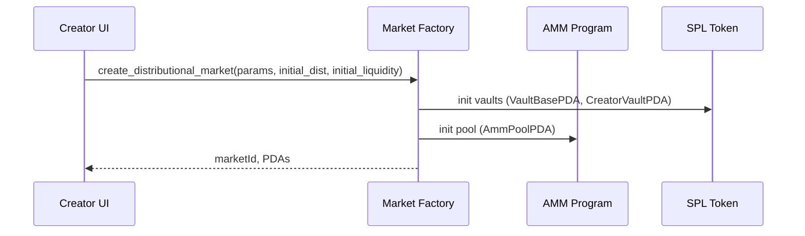
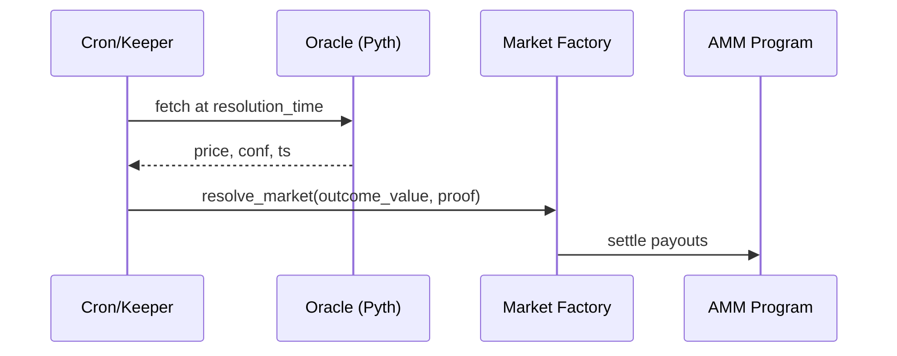

# Market Creator - Detailed User Stories & UI Flow
## Solana On-Chain Workflow

### PDA Layout

```
MarketPDA         = seeds["market", market_symbol]
OrderBookPDA      = seeds["orderbook", MarketPDA]
AmmPoolPDA        = seeds["amm", MarketPDA]
VaultBasePDA      = seeds["vault", MarketPDA, mint]
CreatorVaultPDA   = seeds["creator_vault", MarketPDA, mint]
FeeVaultPDA       = seeds["fees", MarketPDA, mint]
StatsPDA          = seeds["stats", MarketPDA]
```

### Creation Sequence



### Resolution Sequence (Automated Oracle)



## Phase 2: Event Definition & Configuration

### Step 1: Basic Event Information

**UI Components:**

1. **Description of the theme step**:
   - Type: as the structure consisting of 
      - title: description of the thematic investment (within the defi risk solana curator protocols).
      - description: description of the theme prediction market. 
      - associated categories tag: generated via the assistant agent  
      - current listed prediction market questions: 
         - card representing the prediction market question, investor count and the TVL invested. 

1. **Event Title Input**
   - Type: Text field (10-200 characters)
   - Placeholder: "Whats the TVL for the Kamino protocol be after end of October".
   - Validation: Real-time character count, minimum 10 chars. 
   - State: Empty → Typing → Valid/Invalid.
   - Error states: "Title too short" | "Title too long". 

2. **Event Description**
   - Type: Rich text editor (Markdown supported)
   - Placeholder: "Provide context, resolution criteria, and data sources..."
   - Validation: Minimum 50 characters
   - Features: Bold, italic, links, bullet points
   - State: Empty → Editing → Valid

3. **Category Selector**
   - Type: Multi-select dropdown
   - Options: DeFI risk curation in lending, yield , dex trading , prediction of amount transfers or other signals. this will be the multi tab selections.

  - **Source hint**: For Crypto categories, align with DeFiLlama categories (e.g., Dexes, Lending, Yield, Liquid Staking) to enable ecosystem metrics display.
      - State: None selected → 1+ selected
      - Validation: At least one category required

4. **Tags Input**
   - Type: Autocomplete chip input
   - Suggestions: Based on existing popular tags
   - Max: 5 tags
   - State: Empty → Adding tags → Complete

### Step 2: Outcome Variable Configuration (Distributional Markets)

**UI Components:**

1. **Outcome Variable Name**
   - Type: Text input
   - Example: "TVL volume of DeFI" | "yield generation" | "Date"
   - Validation: Required, 3-50 characters.
   - State: Empty → Valid.

2. **Outcome Type Selector**
   - Type: Radio buttons
   - Options:
     - **Numeric Range** (e.g., price, percentage)
     - **Date/Time** (temporal events)
     - **Custom Units** (with unit input field)
   - State: Unselected → Selected
   - Effect: Changes subsequent form fields

3. **Range Definition** (for Numeric Range)
   - **Minimum Value**: Number input
   - **Maximum Value**: Number input
   - **Granularity/Step**: Dropdown (1, 10, 100, 1000, Custom)
   - Validation: Min < Max, realistic range
   - Visual: Range slider preview showing min-max
   - State: Invalid → Valid
   - Error: "Maximum must be greater than minimum"

4. **Date Range** (for Date/Time)
   - **Earliest Date**: Date picker
   - **Latest Date**: Date picker
   - Validation: Future dates only, Latest > Earliest
   - Default: Earliest = Tomorrow, Latest = +2 years

### Step 3: Probability Distribution Design

**UI Component**: Interactive Distribution Chart Builder

**Main Interface:**
- **Canvas**: Large interactive area showing probability distribution curve
- **Y-axis**: Probability density (0-100%)
- **X-axis**: Outcome values (based on range from Step 2)

**Interaction Methods:**

1. **Distribution Template Selector**
   - Type: Dropdown above chart
   - Options:
     - Uniform (flat distribution)
     - Normal/Gaussian (bell curve)
     - Log-normal (right-skewed)
     - Bimodal (two peaks)
     - Custom (free-form)
   - Effect: Populates chart with template shape
   - State: Template selected → Chart updates

2. **Parameter Controls** (for parametric distributions)
   
   **Normal Distribution:**
   - **Mean (μ)**: Slider + number input
   - **Standard Deviation (σ)**: Slider + number input
   - Real-time preview on chart
   - Constraint display: Shows valid σ range based on backing requirements
   
   **Bimodal:**
   - **Component 1 Weight**: Slider (0-100%)
   - **Component 1 Mean**: Slider
   - **Component 1 Std Dev**: Slider
   - **Component 2 Weight**: Auto-calculated (100% - Component 1)
   - **Component 2 Mean**: Slider
   - **Component 2 Std Dev**: Slider

3. **Custom Free-Form Mode**
   - **Interaction**: Click and drag on chart to draw curve
   - **Points**: Add/remove control points
   - **Smoothing**: Toggle for smooth vs. angular curves
   - **Normalization**: Auto-normalize to 100% total probability
   - **Live feedback**: "Current total: 98.5%" with warning if ≠ 100%

4. **Distribution Statistics Panel** (Right sidebar)
   - **Median**: Auto-calculated display
   - **25th Percentile**: Display
   - **75th Percentile**: Display
   - **Expected Value**: Display
   - **Entropy**: Display (measure of uncertainty)
   - Updates in real-time as curve changes

**Validation:**
- Total probability must sum to 100% (±0.1% tolerance)
- No negative probabilities
- Distribution must respect backing constraints (σ_min for Gaussian)
- Visual indicator: Green checkmark when valid, red warning when invalid

**State Flow:**
1. Initial: Uniform distribution loaded
2. User selects template → Chart morphs to template
3. User adjusts parameters → Live preview updates
4. Validation passes → "Continue" button activates
5. User can "Save as Draft" at any time

### Step 4: Resolution & Oracle Configuration

**UI Components:**

1. **Resolution Date/Time**
   - Type: Date-time picker with timezone
   - Validation: Must be in future, minimum 1 hour from now
   - Recommended: At least 24 hours for liquidity
   - State: Invalid (past) → Valid (future)
   - Display: Shows countdown to resolution

2. **Oracle Type Selector**
   - Type: Radio with expandable options
   
   **Option A: Automated Oracle**
   - Chainlink Price Feed (for crypto prices)
   - Pyth Network (for financial data)
   - Custom API endpoint (with URL input)
   - Configuration: Select specific feed ID

   - Solana (Pyth) configuration example:
     - `price_feed_address` (Pyth price account pubkey)
     - `confidence_max_bps` (max allowed confidence interval in basis points)
     - `staleness_max_sec` (max age tolerated)
     - Fallback oracle (optional): Chainlink or manual
   
   **Option B: Manual Resolution**
   - Creator resolves (requires creator signature)
   - Multi-sig resolution (specify addresses)
   - Community vote (define voting parameters)
   
   **Option C: Hybrid**
   - Primary: Automated
   - Fallback: Manual (if automated fails)

3. **Resolution Criteria** (Text area)
   - Detailed rules for outcome determination
   - Examples provided
   - Markdown supported
   - Character limit: 1000
   - Validation: Required, minimum 50 characters

4. **Dispute Period**
   - Type: Number input (hours)
   - Range: 0-168 hours (0-7 days)
   - Default: 24 hours
   - Explanation tooltip: "Window for challenging resolution"

### Step 5: Economic Parameters

**UI Components:**

1. **Initial Liquidity**
   - Type: Number input with token selector
   - Tokens: SOL, USDC, USDT
   - Minimum: Platform enforced (e.g., 100 USDC equivalent)
   - Display: Current wallet balance
   - Validation: Balance ≥ Initial Liquidity + Gas
   - Visual: Progress bar showing min/recommended/your amount
   - State: Below minimum → Meets minimum → Recommended → Generous

2. **Fee Structure Panel**
   
   **Platform Fee** (Read-only)
   - Display: 0.5% (fixed by protocol)
   - Tooltip: "Used for protocol development and maintenance"
   
   **Creator Fee** (Adjustable)
   - Type: Slider (0% - 5%)
   - Default: 1%
   - Display: Estimated earnings based on projected volume
   - Visual: Bar chart showing fee split (Platform | Creator | LP)
   
   **LP Rewards** (Auto-calculated)
   - Display: Remaining % after platform + creator fees
   - Example: If creator = 1%, LP = 98.5%

3. **Trading Parameters**
   
   **Minimum Trade Size**
   - Type: Number input
   - Default: 1 USDC
   - Purpose: Prevent dust trades
   
   **Maximum Trade Size** (Optional)
   - Type: Number input
   - Purpose: Prevent single-trade manipulation
   - Checkbox: "No maximum" (unlimited)

4. **Cost Estimation Panel** (Bottom sticky bar)
   - **Initial Liquidity**: X USDC
   - **Estimated Gas**: ~0.05 SOL
   - **Platform Deployment Fee**: Y SOL (one-time)
   - **Total Required**: X USDC + (Y + 0.05) SOL
   - **Your Balance**: Shows if sufficient
   - Visual: Green if OK, Red if insufficient with "Fund Wallet" link

### Step 6: Review & Deploy

**UI Component**: Summary modal with collapsible sections

**Sections:**

1. **Event Overview** (Expanded by default)
   - Title (with edit icon)
   - Description (truncated, expandable)
   - Category & tags
   - Resolution date (with countdown)

2. **Market Configuration** (Collapsed)
   - Outcome variable & range
   - Distribution chart (static image)
   - Statistics summary
   - Oracle type

3. **Economics** (Collapsed)
   - Initial liquidity
   - Fee breakdown
   - Trading limits

4. **Legal Disclaimer** (Checkbox required)
   - "I confirm this market complies with local regulations"
   - "I understand I'm responsible for resolution accuracy"
   - "I've read and accept the Terms of Service"
   - State: Unchecked (Deploy disabled) → Checked (Deploy enabled)

**Actions:**
- **Back**: Return to any previous step
- **Save Draft**: Store configuration (wallet-linked)
- **Deploy Market**: Trigger wallet transaction

### Step 7: Wallet Transaction Flow

**UI Component**: Transaction modal (Phantom/Solflare integration)

**Flow:**

1. **Transaction Request**
   - Modal: "Approve transaction in your wallet"
   - Display: Transaction details
     - Program: Market Contract Address
     - Accounts: Your wallet, Market PDA, Liquidity vault
     - Amount: Initial liquidity + fees
   - State: Waiting for wallet approval

2. **User Actions in Wallet:**
   - Reviews transaction
   - Approves or Rejects

3. **Transaction States:**
   
   **If Approved:**
   - Modal updates: "Submitting to Solana..."
   - Progress: Spinner with status
   - Confirmation: Waiting for finality (0/32 confirmations)
   - State: Submitted → Confirmed → Finalized
   
   **If Rejected:**
   - Modal: "Transaction cancelled"
   - Options: "Try Again" | "Save Draft" | "Cancel"
   
   **If Error:**
   - Modal: Error message with details
   - Common errors:
     - "Insufficient balance"
     - "Network congestion - try again"
     - "Oracle configuration invalid"
   - Action: "Retry" button with exponential backoff

4. **Success State**
   - Modal: "🎉 Market Created Successfully!"
   - Display:
     - Market ID (copyable)
     - Market URL (copyable, shareable)
     - Transaction signature (link to explorer)
   - Actions:
     - "View Market" → Navigate to market page
     - "Share Market" → Social sharing options
     - "Create Another" → Return to creation flow
     - "Go to Dashboard" → View all created markets

### Step 8: Post-Creation Dashboard

**UI Component**: Market creator dashboard

**Main View:**

1. **Market Stats Card**
   - Current liquidity
   - 24h volume
   - Total trades
   - Active participants
   - Your accrued fees
   - Time to resolution

2. **Distribution Chart** (Live)
   - Current consensus distribution (from trades)
   - Your initial distribution (overlay, dotted)
   - Visual: Shows how market evolved

3. **Activity Feed**
   - Recent trades (anonymized)
   - Large positions entered
   - Distribution shifts

4. **Management Actions**
   
   **Add Liquidity** (Button)
   - Click → Modal with amount input
   - Shows current vs. new liquidity
   - Estimate APY for LP rewards
   - Approve transaction
   
   **Withdraw Fees** (Button)
   - Only if fees > minimum threshold
   - Shows available amount
   - One-click withdrawal to wallet
   
   **Resolve Market** (Button, appears near resolution time)
   - Enabled at resolution_time - 1 hour
   - Click → Resolution modal (next phase)

### Step 9: Market Resolution (At resolution time)

**UI Component**: Resolution modal

**Manual Resolution Flow:**

1. **Outcome Input**
   - If numeric: Number input matching market range
   - If date: Date-time picker
   - Validation: Must be within defined range
   - Optional: Upload proof (image, link)

2. **Resolution Preview**
   - Display: Outcome value
   - Chart: Shows where outcome falls on distribution
   - Payout preview: "~X traders will profit"
   - Warning if outcome seems extreme

3. **Confirm & Submit**
   - Button: "Publish Resolution"
   - Wallet signature required
   - Transaction: Updates market state to "Resolved"

**Automated Resolution Flow:**

1. **Oracle Fetch** (Automatic)
   - System queries oracle at resolution_time
   - Displays: "Fetching from [Oracle Name]..."
   - Result: Outcome value retrieved

2. **Dispute Window**
   - Status: "Resolution pending disputes"
   - Countdown: Shows dispute period remaining
   - Option: "Challenge Resolution" (for participants)

3. **Finalization**
   - After dispute period: Automatic finalization
   - Status: "Market Resolved ✓"
   - Payouts: Automatically distributed

### Step 10: Post-Resolution

**UI Component**: Resolved market view

**Display:**

1. **Final Outcome Banner**
   - Large display: "Final Outcome: $X,XXX"
   - Comparison: vs. initial median, vs. final consensus

2. **Performance Analytics**
   - Chart: Prediction accuracy over time
   - Top traders leaderboard
   - Distribution evolution animation

3. **Creator Summary**
   - Total fees earned
   - Liquidity returned
   - Market statistics
   - Social proof: "X participants, Y volume"

4. **Post-Mortem** (Optional)
   - Creator can write analysis
   - Community can comment
   - Used for reputation building

---

## State Transition Summary

```
[Landing Page] 
    ↓ (Select Market Type)
[Configuration Form]
    ↓ (Define Event)
[Distribution Design]
    ↓ (Configure Oracle)
[Economic Setup]
    ↓ (Review)
[Transaction Approval]
    ↓ (Blockchain Confirmation)
[Active Market]
    ↓ (Monitor & Manage)
[Resolution Time]
    ↓ (Publish Outcome)
[Dispute Period]
    ↓ (Finalize)
[Resolved Market]
```

## UI Component State Matrix

| Component | States | Transitions |
|-----------|--------|-------------|
| Market Type Selector | Unselected, Selected | Click → Selected |
| Event Title Input | Empty, Typing, Valid, Invalid | Input → Validation |
| Distribution Chart | Template, Editing, Valid, Invalid | Drag/Param change → Validation |
| Resolution Date | Past (Invalid), Future (Valid) | Date selection → Validation |
| Liquidity Input | Below Min, Sufficient, Generous | Amount input → Validation |
| Deploy Button | Disabled, Enabled, Loading, Success, Error | Form validation → Enable → Click → Loading → Result |
| Market Status | Draft, Deploying, Active, Resolving, Disputed, Resolved | Transaction confirmations |

## Validation Rules Summary

- **Event Title**: 10-200 characters, no special chars in first/last position
- **Description**: Minimum 50 characters, Markdown valid
- **Distribution**: Sum to 100% (±0.1%), all probabilities ≥ 0
- **Resolution Date**: > current time + 1 hour
- **Initial Liquidity**: ≥ platform minimum, ≤ wallet balance
- **Creator Fee**: 0-5%
- **All required fields**: Must be completed before deployment

## Error Handling

| Error Scenario | UI Response | Recovery Action |
|----------------|-------------|-----------------|
| Insufficient balance | Red warning, "Fund Wallet" link | Add funds or reduce liquidity |
| Network timeout | "Transaction pending" with retry | Auto-retry 3x, then manual |
| Invalid distribution | Inline chart error, disable Continue | Adjust parameters until valid |
| Oracle unreachable | Warning icon, suggest backup | Switch to manual/hybrid |
| Duplicate market title | "Similar market exists" warning | Proceed or view existing |
| Gas spike | "High network fees" warning | Wait or adjust priority fee |
