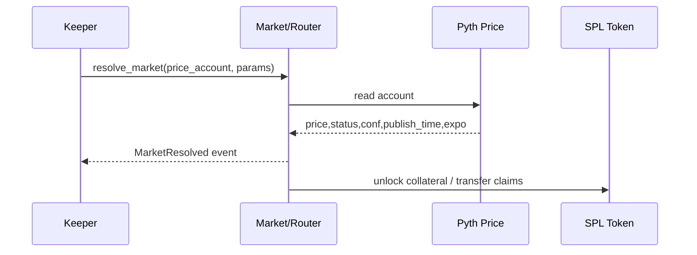

# Oracle Resolution Flow (Pyth)

## Goal
Resolve markets on-chain using Pyth price accounts securely on Solana.

## On-Chain Verification
- Require the Pyth `price` account as an account input.
- Validate:
  - `status == Trading`
  - `staleness`: `now - publish_time <= STALENESS_LIMIT`
  - `confidence <= MAX_CONFIDENCE`
- Normalize price: `normalized = price * 10^exponent`
- Emit `MarketResolved { market, outcome_i64, ts }` event

## Instruction (Anchor)
- `resolve_market({ market: Pubkey, price_account: Pubkey, params: { staleness_limit, max_confidence } })`
  - Reads Pyth price account data
  - Performs the checks above
  - Writes outcome into `Market` and unlocks collateral via `router::settle()` or post-resolution claim path

## Cross-Chain Note
- Cryptographic proofs (VAAs) are not needed within Solana; they are required cross-chain.

## Diagram

## UI/Flows
- Creator sets oracle on market creation
- Keeper/authority calls `resolve_market` with Pyth account
- Participants see claimable balances; `claim()` triggers settlement transfers
