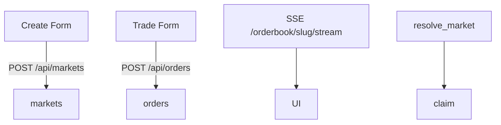

# Web Enhancements Plan (Phase 3)

## Goals
- Creator validation UX (Zod schemas, inline errors)
- Participant collateral preview (per `MATHEMATICAL_FRAMEWORK.md` discretization)
- Claims flow post-resolution
- DB/Program wiring once programs are live

## Creator Flow
- Zod schema for market creation:
  - title (1..120), category (enum), range (min<max), resolution_time (future), oracle pubkey
- Inline errors + disabled Deploy until valid
- POST `/api/markets` (DB) initially; later switch to `market_factory::create_market`

## Participant Flow
- Range order composer (existing)
- Collateral preview: compute `Collateral ≈ −minᵢ [gᵢ − fᵢ]` on grid:
  - Given current (μ,σ) and proposed (μ',σ'), compute discretized PDFs on N bins and estimate minimum difference
  - Show collateral in UI prior to sign/submit
- Order placement:
  - Now: POST `/api/orders`
  - Later: call `router::route_order` (CLOB then AMM), capture txSig and show pending

## Claims Flow
- After `MarketResolved`, show claimable amount per user position
- `claim()` hits API that will call `router::settle` once program is live; for now, stub out and mark as future

## Orderbook
- SSE consuming `/api/orderbook/[slug]/stream` (DB-backed for now)
- After GSIs, switch scans to `QueryCommand` on top-of-book GSIs

## Pages/Components
- `app/create/page.tsx`: already posts to `/api/markets`, add zod client schema and form-level validation
- `app/markets/[slug]/page.tsx`: DB-backed; add collateral panel component `CollateralPreviewClient`
- `components/orders/usePlaceRangeOrder.ts`: POST to `/api/orders`; later add on-chain path

## Feature Flags
- `NEXT_PUBLIC_ONCHAIN=false` initially; toggle when programs are live

## Performance
- Cache: keep `useDailyJSON` for home list; set TTL 1h
- Use server actions to fetch top-of-book once GSIs are available

## Diagrams

